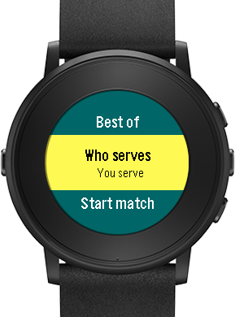
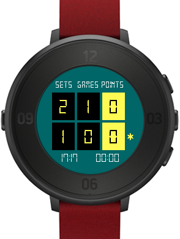
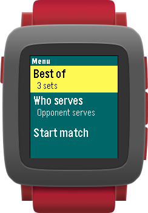
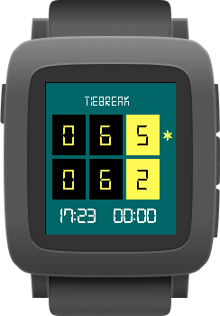
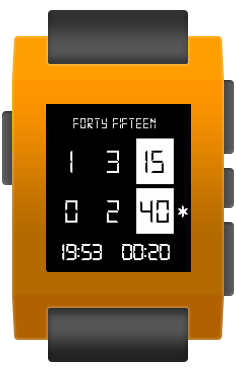

Tennis Score for Pebble
==================
Are you a tennis player and a Pebble owner? Now you can play a match and keep track of the score in your Pebble! **Tennis Score** tracks points, games, sets and who is serving. Update the score by pressing a button; undo available. Choose between best of 3 or 5 sets; tiebreak for all sets. Shows current time and match duration in minutes.

Works in Pebble Time Round, Time Steel, Time, Steel and Classic.

## Usage
**Menu**

- Select whether you will play best of 3 or best of 5 sets.

- Select who starts serving.

- Start match!

**Match**

Use buttons (http://i.imgur.com/4i9NeDU.jpg) to track the score :

- Up: point to your opponent

- Down: point to you

- Select: undo last point; as many times as you want

- Back: exit to main menu

**Score**

- Upper row: your opponent score

- Lower row: your score

- Left time: current time

- Right time: match duration in minutes

- Asterisk: who is serving

## Screenshots

## About

Dialog and message windows are based on Pebble examples UIPatterns: https://github.com/pebble-examples/ui-patterns

Limitations: Tennis Score for Pebble keeps track up to 180 points for Pebble Classic and Steel, and up to 600 points for the other models.
